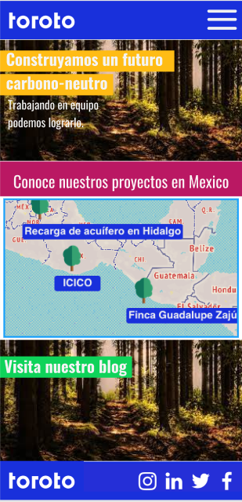
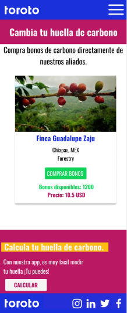
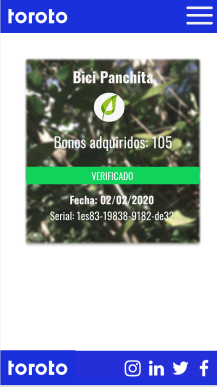

# Toroto. Carbon-neutral challenge.

  
Toroto aims to build a carbon-neutral society. We observe that most efforts with similar objectives work on reducing the amount of greenhouse gases that are emitted to the atmosphere.

[Toroto](https://www.toroto.mx/es)

## What is it about?

The challenge in to build a website for buy and verify carbon offsets. Actually, buy and check carbon offsets is difficult or confussing, with no much info about the projects reducing carbon emitions.

Following the UI Toroto already has, I designed a web app, with mobile first approach, to make the carbon offsets purchase in the easiliest way possible.





These designs are a quick look to the main functions of the app.


## To run locally:

Download or clone the repo. Add dependencies with ```yarn add``` or ```npm install```.
Afther that, go to your terminal and type ```cd toroto```to get into the main folder. Now you can launch locally with ```yarn start```.

### Other info:

- this is a [React](https://es.reactjs.org/) app. 
- this app uses [SASS](https://sass-lang.com/). Personally I recommend the use of [Sass compiler](https://marketplace.visualstudio.com/items?itemName=ritwickdey.live-sass) in Visual Studio Code.
- this app uses [Mapbox](https://www.mapbox.com/). You can change the style or the location of the main map.

If you want to know more about carbon offsets, go to [Earth](https://earth.org/global-carbon-offset-market/) or [Toroto](https://www.toroto.mx/en)

#### Made with :heart: by Mara Mulato | 2021
